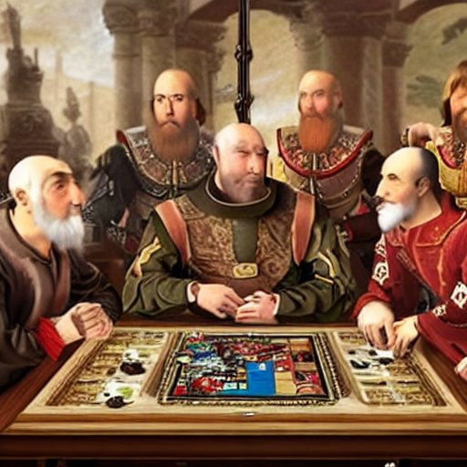

# EvoCoup

_(This project is a very early stage work-in-progress)_

### What is Coup?

[Coup](https://www.ultraboardgames.com/coup/game-rules.php) is a strategic card game 
where players are attempting to eliminate their opponents by using their unique 
character abilities to deceive and outmaneuver them. Each player starts with two 
character cards that they keep secret and can take actions that may or may not match 
their actual character cards, forcing opponents to question their legitimacy. The 
game ends when only one player is left standing, or when a player successfully 
eliminates all other players' characters.

### What is EvoCoup?

EvoCoup will be an exploration of game theory and evolutionary algorithms applied to the 
game of Coup. The goal is to create an AI that can learn to play Coup by playing against other 
AIs and evolving over time. What strategies will emerge? How do styles of play change over time?
Which works better, deep reinforcement learning, or evolutionary algorithms?

### Roadmap
* [x] Setup a basic Coup game engine.
* [ ] Integrate a neuro-evolution compatible framework, such as [EvoTorch](https://evotorch.ai/).
* [ ] Integrate with OpenAI's [Gymnasium](https://github.com/Farama-Foundation/Gymnasium).
* [ ] Develop a small web app to allow users to play against the AI.

