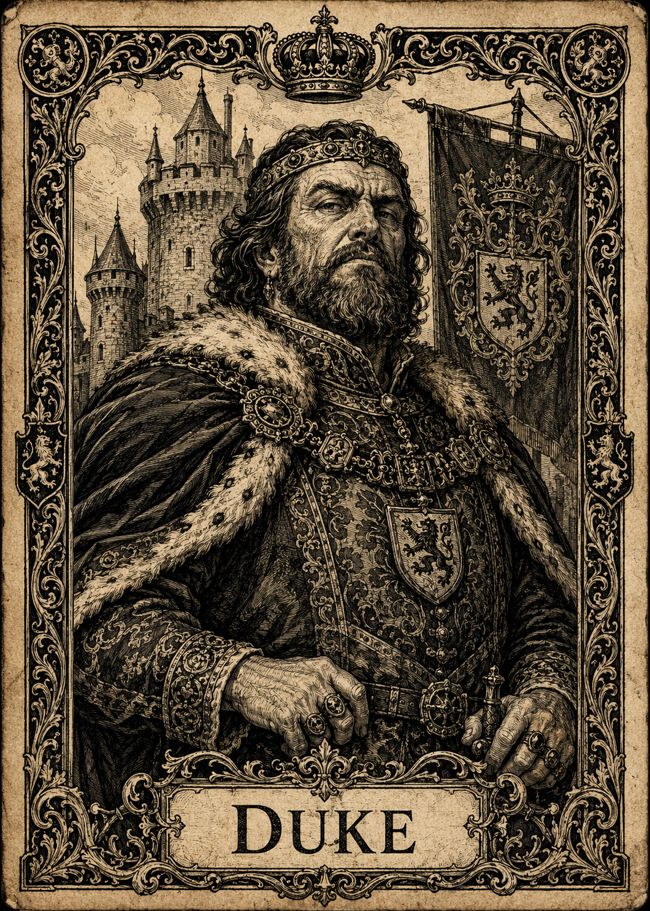
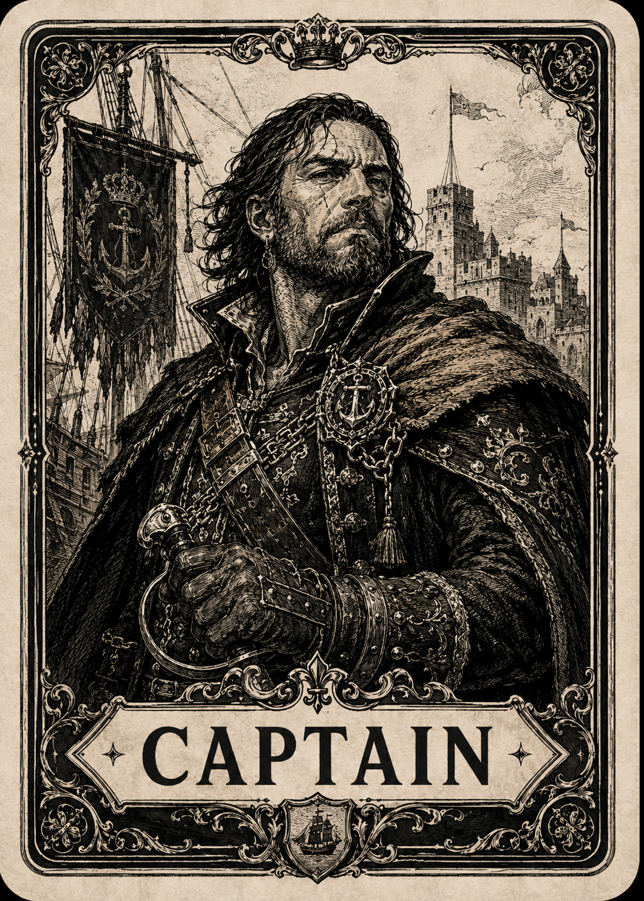

# EvoCoup


EvoCoup is a local web game and AI sandbox for playing faithful games of [Coup](https://www.ultraboardgames.com/coup/game-rules.php) against large language models—or watching a table of models play against one another.

The project began as an experiment in evolving recurrent neural networks. Its new direction replaces that idea with LLM-controlled players, a rigorously tested rules engine, and an animated browser interface. The EvoCoup name is retained for now and may change later.

> **Status:** the standalone Python rules engine, in-memory FastAPI match runner, OpenAI structured-decision adapter, and playable React interface are implemented and tested. See [PLAN.md](PLAN.md) for the full specification.

## The game

Coup is a bluffing and deduction card game. Each player begins with two hidden character cards representing their influence at court. On a turn, a player may take an ordinary action or claim a character's power—whether or not they actually hold that character. Other players can challenge the claim or counteract the action with claims of their own. The last player with influence remaining wins.

EvoCoup will implement the published base rules for two through six players, including the published two-player variant.

## V1 goals

- Play locally as one human against one to five OpenAI-controlled opponents.
- Watch games containing two to six OpenAI-controlled players.
- Enforce all rules in a deterministic, independently tested Python engine.
- Make every AI action, challenge, block, reveal, and exchange choice through a genuine model decision.
- Give each agent only its own hidden cards and the public history of the match.
- Animate the table in a React and TypeScript frontend backed by FastAPI and WebSockets.
- Support pause, step, normal-speed, accelerated, and instant AI-only play.
- Provide an optional developer panel showing model inputs, legal choices, decisions, concise rationales, latency, token usage, and errors.
- Stop safely on OpenAI API failures and allow the failed decision to be retried without substituting a fallback move.

V1 will run entirely on a laptop with an OpenAI API key. It will not require accounts, deployment, a database, or saved games.

## Architecture

The planned implementation separates four concerns:

1. **Rules engine** — a pure Python state machine that owns legal moves, hidden information, randomness, challenges, counteractions, and victory.
2. **Match runner** — coordinates human and AI decision providers without duplicating game rules.
3. **OpenAI adapter** — sends a private seat-specific view and engine-generated legal choices to the Responses API, then validates one structured decision.
4. **Web application** — a FastAPI/WebSocket backend and animated React/TypeScript table.

The model will never mutate game state directly. It chooses from options generated by the rules engine, and the engine validates every response before applying it.

## Development roadmap

- [x] Audit the original simulator and define the new product direction.
- [x] Specify the canonical rules, architecture, testing strategy, and v1 scope.
- [x] Preserve the original simulator under `legacy/` and scaffold the Python project.
- [x] Build the standalone rules engine with unit and property tests.
- [x] Stress-test 10,000 complete headless games with test-only policies.
- [x] Build the in-memory FastAPI match runner and WebSocket API.
- [x] Add the OpenAI structured-decision adapter and diagnostics.
- [x] Build the functional React game table and human decision flows.
- [x] Add spectator controls, API error recovery, and the optional developer panel.
- [ ] Continue animation and visual polish after hands-on playtesting.

The detailed milestones, acceptance criteria, rule edge cases, and deferred features live in [PLAN.md](PLAN.md).

## Development

Install the backend and frontend dependencies, then build the website:

```bash
uv sync
cd frontend
npm install
npm run build
cd ..
```

Launch EvoCoup:

```bash
uv run uvicorn evocoup.api.app:app --reload
```

Open `http://127.0.0.1:8000` to play. If no key is configured, the site asks for one and the local server writes it to the git-ignored `.env` file with owner-only permissions. The provider is configured immediately without a restart. The key is never returned by the API or included in diagnostics.

You can instead configure the environment before launching by copying `.env.example` to `.env` and setting `OPENAI_API_KEY` manually. The generated API documentation remains available at `http://127.0.0.1:8000/docs` for development.

Run all ordinary verification checks with:

```bash
uv run pytest
uv run ruff check src tests
uv run mypy src tests
cd frontend
npm run build
npm run lint
npm test
```

The ordinary suite includes unit tests, generated property tests, and hundreds of complete headless games. The separate 10,000-game stress target takes several minutes:

```bash
uv run pytest -m long
```

For frontend development with hot reload, run the backend and Vite in separate terminals:

```bash
# Terminal 1, from the repository root
uv run uvicorn evocoup.api.app:app --reload

# Terminal 2
cd frontend
npm run dev
```

The Vite development site is available at `http://127.0.0.1:5173` and proxies game requests to the backend.

## Visual direction

The interface is moving toward an original Renaissance woodcut and engraved-card aesthetic.

<table>
  <tr>
    <td align="center"><br><strong>Duke</strong></td>
    <td align="center"><br><strong>Assassin</strong></td>
    <td align="center"><br><strong>Captain</strong></td>
  </tr>
  <tr>
    <td align="center"><br><strong>Ambassador</strong></td>
    <td align="center"><br><strong>Contessa</strong></td>
    <td align="center"><br><strong>Card back</strong></td>
  </tr>
</table>

## Current prototype

[`legacy/coup.py`](legacy/coup.py) is the original command-line simulator. It randomly chooses actions and responses to exercise an early implementation of the game loop. It does not contain an RNN, evolutionary training, LLM integration, or the new rules architecture, and it has known rule-resolution defects. It is retained as historical context rather than extended into the new application.

## Future directions

After v1, possible additions include table dialogue and negotiation, distinct agent personalities, per-seat models, multiple model providers, persistent match replays, batch tournaments and win-rate analysis, final artwork, and sound. Evolutionary learning is no longer a project goal.

## Disclaimer

This is a personal, noncommercial fan project. Coup was designed by Rikki Tahta and is published by Indie Boards & Cards. This project is not affiliated with or endorsed by the designer or publisher.
